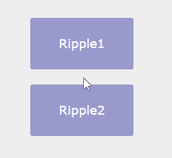

# pure css ripple effect

If you have used lollipop version of android you see a nice ripple effect on button clicks. This tutorial is about achieving similar result, the css ripple effect using only css. For tutorial  http://androidcss.com/css/pure-css-ripple-effect/
